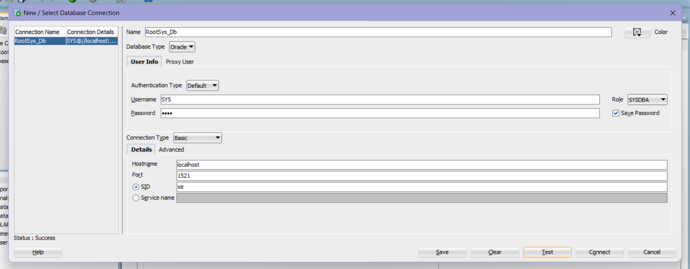
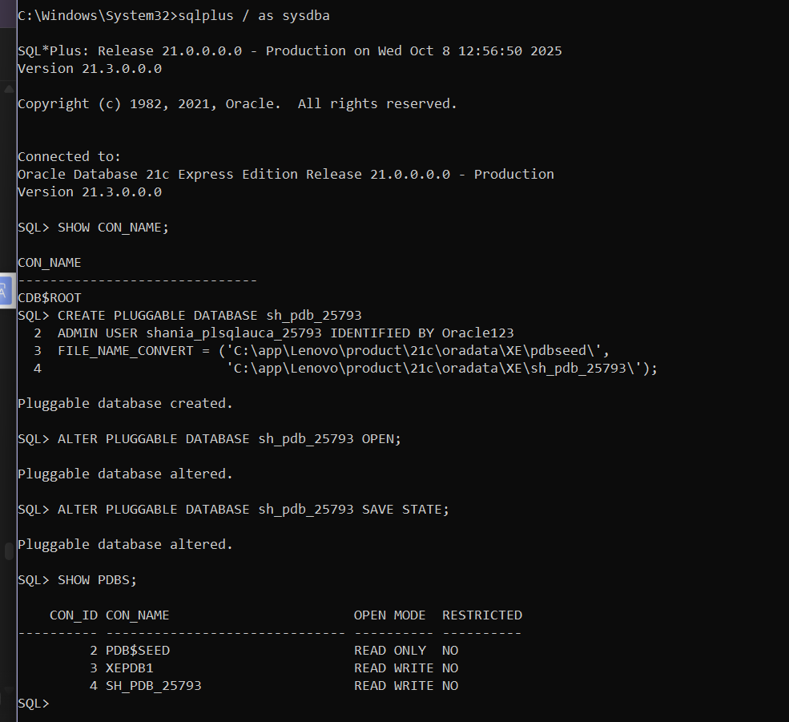
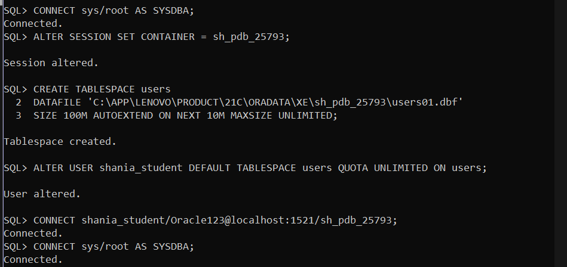
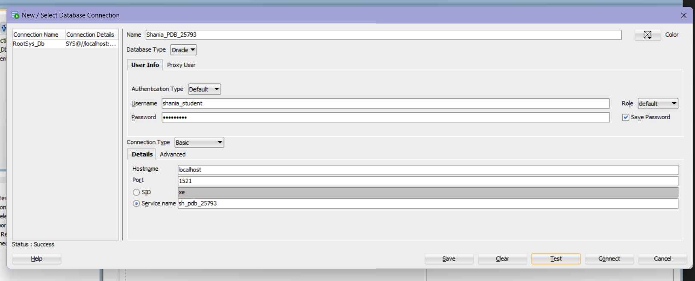
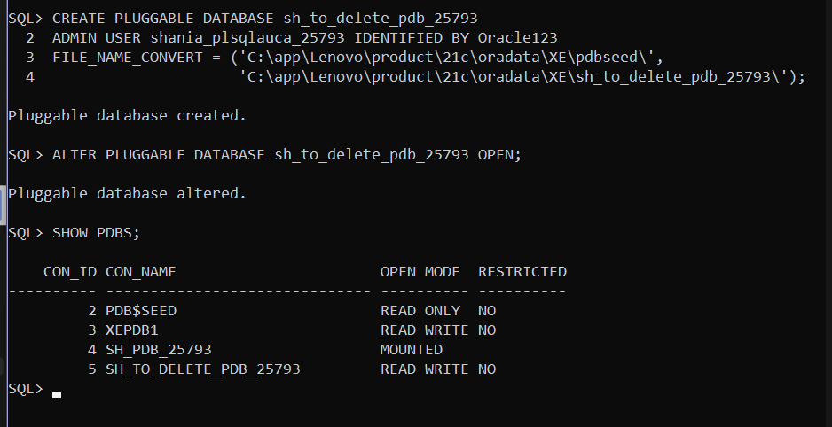
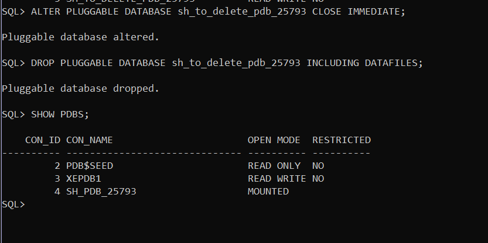
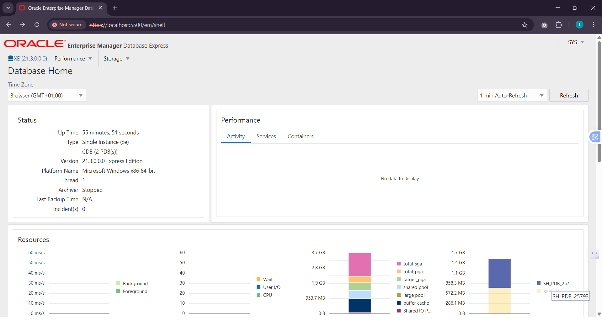
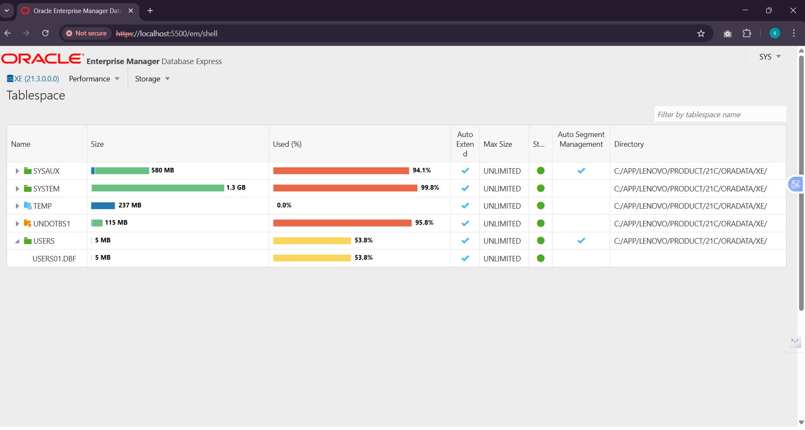

# Report on Oracle Database Practical Tasks

**Name:** KEZA SHANIA  
**ID:** 25793  
**Course:** Database Development with PL/SQL (INSY 8311)  
**Group:** C  
**Overview:** PDB Management Assignment No3  
**Date:** 8/10/2025

This practical assignment was a valuable exercise in hands-on Oracle database administration, focusing on the multi-tenant architecture (CDBs and PDBs) and the use of the graphical management tool, Oracle Enterprise Manager (OEM).  

I successfully completed all three required tasks:

1. **Creation and Configuration:** I created and configured my permanent PDB (`sh_pdb_25793`) for class coursework.  
2. **Life-cycle Management:** I practiced database life-cycle management by creating and deleting a temporary PDB.  
3. **Verification:** I accessed and verified the setup using the required OEM Express dashboard.  

---

## Task 1: Creating My Coursework PDB

My first step was to establish the database environment for my class work. I created a new pluggable database, naming it `sh_pdb_25793`, by cloning the existing seed PDB. I also defined two users: an administrative user (`shania_plsqlauca_25793`) and my primary student account (`shania_student`) inside the new PDB.  

Here are the commands I used to create, open, and save the state of my new PDB:

```sql
-- 1. Created the new PDB and administrative user
CREATE PLUGGABLE DATABASE sh_pdb_25793 
ADMIN USER shania_plsqlauca_25793 IDENTIFIED BY Oracle123 
FILE_NAME_CONVERT = (
    'C:\app\Lenovo\product\21c\oradata\XE\pdbseed\', 
    'C:\app\Lenovo\product\21c\oradata\XE\sh_pdb_25793\'
);

-- 2. Open the PDB for read/write access
ALTER PLUGGABLE DATABASE sh_pdb_25793 OPEN;

-- 3. Ensure the PDB opens automatically on database startup
ALTER PLUGGABLE DATABASE sh_pdb_25793 SAVE STATE;

```




-- Additional steps to create the main student user (shania_student) inside the PDB were executed separately.



--Also, I additionally connected my student user to my sql developer:



## Task 2: Create and Delete a Temporary PDB

Next, I focused on testing the full life-cycle management process. I created a second, temporary PDB named `sh_to_delete_pdb_25793`. After verifying its creation, I immediately closed and permanently dropped it along with its associated data files to ensure I understood the deletion syntax.  

The ability to create and quickly drop databases demonstrates the core flexibility of Oracle's multi-tenant architecture.  

Here are the commands I used for this task:

```sql
-- 1. Create the temporary PDB
CREATE PLUGGABLE DATABASE sh_to_delete_pdb_25793 
ADMIN USER shania_plsqlauca_25793 IDENTIFIED BY Oracle123 
FILE_NAME_CONVERT = (
    'C:\app\Lenovo\product\21c\oradata\XE\pdbseed\', 
    'C:\app\Lenovo\product\21c\oradata\XE\sh_to_delete_pdb_25793\'
);

-- 2. Close the PDB before dropping
ALTER PLUGGABLE DATABASE sh_to_delete_pdb_25793 CLOSE IMMEDIATE;

-- 3. Permanently drop the PDB and its files
DROP PLUGGABLE DATABASE sh_to_delete_pdb_25793 INCLUDING DATAFILES;
```




## Task 3: Oracle Enterprise Manager (OEM) Verification

After confirming the PDB environment was correctly set up (with only `sh_pdb_25793` remaining), I accessed the web interface. I successfully configured and accessed Oracle Enterprise Manager (OEM) Express using the URL determined during the 21c installation.  

I was able to log in using my administrative credentials and confirm the presence of the root container and my new PDB.  

**Access URL:** [https://localhost:5501/em](https://localhost:5501/em)  

**Image placeholder:**  




---

## Notes and Challenges Encountered

The most significant challenge I faced was ensuring I was running the correct version of Oracle to complete Task 3:

- **Initial Issue (23ai):** I started with Oracle Database 23ai, but discovered it does not support the classic Oracle Enterprise Manager (OEM) Express dashboard required for the assignment, resulting in "Not Implemented" errors.  
- **Resolution (Downgrade):** To meet the assignment's explicit requirement, I uninstalled 23ai and installed Oracle 21c Express Edition, which includes the OEM Express feature.  
- **Second Challenge (Cleanup):** During 21c installation, I encountered configuration errors caused by remnants of the old 23ai installation in the Windows Registry and file system. I resolved this by removing all old Oracle folders, resetting relevant environment variables, and running the installer again with administrator privileges.  
- **Outcome:** After these troubleshooting steps, the 21c installation and connection to the OEM interface at [https://localhost:5501/em](https://localhost:5501/em) succeeded, allowing me to fully complete the assignment.
